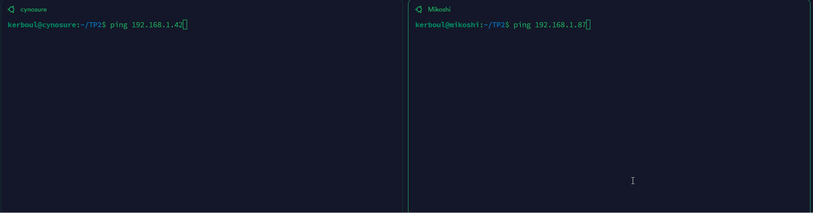
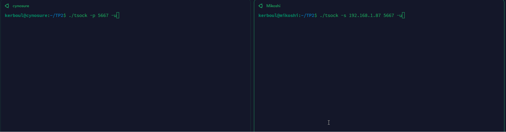
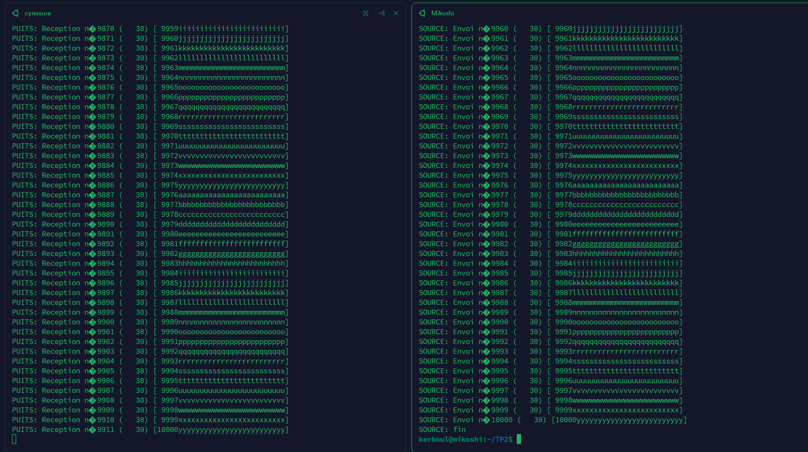

# TP 2 réseau

### Team
Raphaël, Ethan, Antonin

## Sommaire
### [Partie 1](#partie-1)
### [Partie 2](#partie-2)
--------------------
## Partie 1
Configuration de deux VM chez Ethan (Cynosure, Mikoshi)  
Machine | Cynosure     | Mikoshi      |
| ------------- | ------------- | ------------- |
| IPAdress | 192.168.1.87 | 192.168.1.42 |
| Mask | 255.255.255.0 | 255.255.255.0 |

Ping :



  
-------
## Partie 2

Machine | Cynosure     | Mikoshi      |
| ------------- | ------------- | ------------- |
| puit | ````./tsock -p 5667 ```` | ````./tsock -p 5668```` |
| source | ````./tsock -s 192.168.1.42 5668```` | ````./tsock -s 192.168.1.87 5667```` |

TCP :

UDP :

#### 1
a) UDP :


b) On constate des pertes avec UDP :



à l'inverse de TCP qui ne perd pas de packages