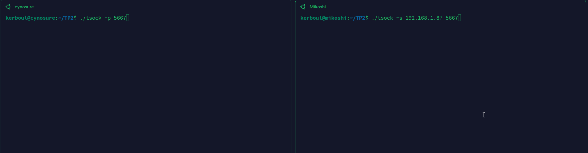

# TP 2 réseau

### Team
Raphaël, Ethan, Antonin

## Sommaire
- [TP 2 réseau](#tp-2-réseau)
    - [Team](#team)
  - [Sommaire](#sommaire)
  - [Partie 1](#partie-1)
  - [Partie 2](#partie-2)
    - [Exercice 1](#exercice-1)
    - [Exercice 2](#exercice-2)
    - [Exercice 3](#exercice-3)
    - [Exercice 4](#exercice-4)
    - [Exercice 5](#exercice-5)
--------------------

## Partie 1
Configuration de deux machines chez Ethan (Cynosure, Mikoshi)
   Machine    | Cynosure     | Mikoshi      |
 |------------|--------------|--------------|
 | IPAdress   | 192.168.1.87 | 192.168.1.42 |
 | Mask       | 255.255.255.0 | 255.255.255.0 |

Ping :


-------

## Partie 2
 | Machine    | Cynosure                         | Mikoshi                          |
 |------------|----------------------------------|----------------------------------|
 | puit       | ```./tsock -p 5667```            | ```./tsock -p 5668```            |
 | source     | ```./tsock -s 192.168.1.42 5668``` | ```./tsock -s 192.168.1.87 5667``` |

TCP :


UDP :


### Exercice 1
a) UDP :


b) On constate des pertes avec UDP :


à l'inverse de TCP qui ne perd pas de packages :


c) L'expérience consiste à saturer la communication UDP

````shell
# Mikoshi
./tsock -s 192.168.1.87 5667 -u -n 10000 -l 15000
# Cynosure
./tsock -p 5667 -u -15000
````
### Exercice 2
a) Avec UDP, on observe qu'aucun package part, mais pas d'erreur particulière :


alors qu'en TCP, on observe une erreur d'ouverture de flux :


b) UDP n'a jamais reçu les packages, mais n'a pas relevé d'erreurs. Ce n'est pas un comportement souhaitable, ni acceptable, car il ne permet pas de savoir si la communication a fonctionné.

### Exercice 3
a)

b)
On peut voir le login avec TCP :

Log ici :

````shell
09:37:59.556289 IP 192.168.1.42.53801 > cynosure.nsca: Flags [S], seq 3811600990, win 64240, options [mss 1460,sackOK,TS val 3088549141 ecr 0,nop,wscale 7], length 0
09:37:59.556392 IP cynosure.nsca > 192.168.1.42.53801: Flags [S.], seq 3556977975, ack 3811600991, win 65160, options [mss 1460,sackOK,TS val 3686256413 ecr 3088549141,nop,wscale 7], length 0
09:37:59.556664 IP 192.168.1.42.53801 > cynosure.nsca: Flags [.], ack 1, win 502, options [nop,nop,TS val 3088549142 ecr 3686256413], length 0
09:37:59.556757 IP 192.168.1.42.53801 > cynosure.nsca: Flags [P.], seq 1:31, ack 1, win 502, options [nop,nop,TS val 3088549142 ecr 3686256413], length 30
09:37:59.556779 IP cynosure.nsca > 192.168.1.42.53801: Flags [.], ack 31, win 502, options [nop,nop,TS val 3686256455 ecr 3088549142], length 0
09:37:59.556814 IP 192.168.1.42.53801 > cynosure.nsca: Flags [F.], seq 31, ack 1, win 502, options [nop,nop,TS val 3088549142 ecr 3686256413], length 0
09:37:59.556906 IP cynosure.nsca > 192.168.1.42.53801: Flags [F.], seq 1, ack 32, win 502, options [nop,nop,TS val 3686256455 ecr 3088549142], length 0
09:37:59.557156 IP 192.168.1.42.53801 > cynosure.nsca: Flags [.], ack 2, win 502, options [nop,nop,TS val 3088549142 ecr 3686256455], length 0
````
c)
Il faut que le paquet tcp envoyé ait une taille suppérieure à MSS.
Quand on envoit un paquet de 35 000 octets, on a un découpage qui s'opère alors, et les données sont reçues dans l'ordre, même si mal delimitées (flux).

On voit dans les logs ci dessous la reception non-pas d'un paquet tcp, mais bien de plusieurs de taille variables:
````shell
    192.168.1.42.32783 > cynosure.nsca: Flags [S], cksum 0x0d1e (correct), seq 129520240, win 64240, options [mss 1460,sackOK,TS val 3089699739 ecr 0,nop,wscale 7], length 0
09:57:10.154360 IP (tos 0x0, ttl 64, id 0, offset 0, flags [DF], proto TCP (6), length 60)    cynosure.nsca > 192.168.1.42.32783: Flags [S.], cksum 0x8400 (incorrect -> 0x3b63), seq 3461727828, ack 129520241, win 65160, options [mss 1460,sackOK,TS val 3687407005 ecr 3089699739,nop,wscale 7], length 0
09:57:10.154651 IP (tos 0x0, ttl 64, id 8639, offset 0, flags [DF], proto TCP (6), length 52)
    192.168.1.42.32783 > cynosure.nsca: Flags [.], cksum 0x66c1 (correct), ack 1, win 502, options [nop,nop,TS val 3089699740 ecr 3687407005], length 0
09:57:10.155397 IP (tos 0x0, ttl 64, id 8640, offset 0, flags [DF], proto TCP (6), length 2948)
    192.168.1.42.32783 > cynosure.nsca: Flags [.], cksum 0x8f48 (incorrect -> 0x3f25), seq 1:2897, ack 1, win 502, options [nop,nop,TS val 3089699740 ecr 3687407005], length 2896
09:57:10.155443 IP (tos 0x0, ttl 64, id 22477, offset 0, flags [DF], proto TCP (6), length 52)
    cynosure.nsca > 192.168.1.42.32783: Flags [.], cksum 0x83f8 (incorrect -> 0x5b15), ack 2897, win 546, options [nop,nop,TS val 3687407053 ecr 3089699740], length 0
09:57:10.155482 IP (tos 0x0, ttl 64, id 8642, offset 0, flags [DF], proto TCP (6), length 4396)
    192.168.1.42.32783 > cynosure.nsca: Flags [P.], cksum 0x94f0 (incorrect -> 0x143b), seq 2897:7241, ack 1, win 502, options [nop,nop,TS val 3089699740 ecr 3687407005], length 4344
09:57:10.155482 IP (tos 0x0, ttl 64, id 8645, offset 0, flags [DF], proto TCP (6), length 7292)
    192.168.1.42.32783 > cynosure.nsca: Flags [P.], cksum 0xa040 (incorrect -> 0x2924), seq 7241:14481, ack 1, win 502, options [nop,nop,TS val 3089699740 ecr 3687407005], length 7240
09:57:10.155504 IP (tos 0x0, ttl 64, id 22478, offset 0, flags [DF], proto TCP (6), length 52)
    cynosure.nsca > 192.168.1.42.32783: Flags [.], cksum 0x83f8 (incorrect -> 0x49d9), ack 7241, win 614, options [nop,nop,TS val 3687407053 ecr 3089699740], length 0
09:57:10.155562 IP (tos 0x0, ttl 64, id 22479, offset 0, flags [DF], proto TCP (6), length 52)
    cynosure.nsca > 192.168.1.42.32783: Flags [.], cksum 0x83f8 (incorrect -> 0x2d8f), ack 14481, win 616, options [nop,nop,TS val 3687407053 ecr 3089699740], length 0
09:57:10.155926 IP (tos 0x0, ttl 64, id 8650, offset 0, flags [DF], proto TCP (6), length 5844)
    192.168.1.42.32783 > cynosure.nsca: Flags [P.], cksum 0x9a98 (incorrect -> 0x79ba), seq 14481:20273, ack 1, win 502, options [nop,nop,TS val 3089699741 ecr 3687407053], length 5792
09:57:10.155926 IP (tos 0x0, ttl 64, id 8654, offset 0, flags [DF], proto TCP (6), length 8740)
    192.168.1.42.32783 > cynosure.nsca: Flags [P.], cksum 0xa5e8 (incorrect -> 0x88fb), seq 20273:28961, ack 1, win 502, options [nop,nop,TS val 3089699741 ecr 3687407053], length 8688
09:57:10.155972 IP (tos 0x0, ttl 64, id 22480, offset 0, flags [DF], proto TCP (6), length 52)
    cynosure.nsca > 192.168.1.42.32783: Flags [.], cksum 0x83f8 (incorrect -> 0x16ac), ack 20273, win 681, options [nop,nop,TS val 3687407054 ecr 3089699741], length 0
09:57:10.156003 IP (tos 0x0, ttl 64, id 22481, offset 0, flags [DF], proto TCP (6), length 52)
    cynosure.nsca > 192.168.1.42.32783: Flags [.], cksum 0x83f8 (incorrect -> 0xf4d1), ack 28961, win 659, options [nop,nop,TS val 3687407054 ecr 3089699741], length 0
09:57:10.156065 IP (tos 0x0, ttl 64, id 8660, offset 0, flags [DF], proto TCP (6), length 6092)
    192.168.1.42.32783 > cynosure.nsca: Flags [FP.], cksum 0x9b90 (incorrect -> 0x1506), seq 28961:35001, ack 1, win 502, options [nop,nop,TS val 3089699741 ecr 3687407053], length 6040
09:57:10.156089 IP (tos 0x0, ttl 64, id 22482, offset 0, flags [DF], proto TCP (6), length 52)
    cynosure.nsca > 192.168.1.42.32783: Flags [.], cksum 0x83f8 (incorrect -> 0xdd2d), ack 35002, win 670, options [nop,nop,TS val 3687407054 ecr 3089699741], length 0
09:57:10.156175 IP (tos 0x0, ttl 64, id 22483, offset 0, flags [DF], proto TCP (6), length 52)
    cynosure.nsca > 192.168.1.42.32783: Flags [F.], cksum 0x83f8 (incorrect -> 0xdd21), seq 1, ack 35002, win 681, options [nop,nop,TS val 3687407054 ecr 3089699741], length 0
09:57:10.406685 IP (tos 0x0, ttl 64, id 22484, offset 0, flags [DF], proto TCP (6), length 52)
    cynosure.nsca > 192.168.1.42.32783: Flags [F.], cksum 0x83f8 (incorrect -> 0xdc26), seq 1, ack 35002, win 681, options [nop,nop,TS val 3687407305 ecr 3089699741], length 0
09:57:10.407123 IP (tos 0x0, ttl 64, id 0, offset 0, flags [DF], proto TCP (6), length 52)    192.168.1.42.32783 > cynosure.nsca: Flags [.], cksum 0xdbde (correct), ack 2, win 502, options [nop,nop,TS val 3089699992 ecr 3687407305], length 0
````

En revanche, si on regarde la MTU, on remarque que les chiffres ne concordent pas : 1500 de MTU en envoi, mais pourtant on reçoit des paquets de taille >6000.
Il semble qu'il faille configurer tcpdump (plus précisement, TCP Segmentation Offload), mais les machines utilisées étant critiques pour le réseau local de éthan, nous n'avons pas voulu prendre de risque.

### Exercice 4
a,b,c,d) 
Pour TCP :
(*) Les adresses MAC ne sont pas les mêmes, car nous avons effectué le TP sur des machines réelles dans le cluster physique d'Ethan.
 | Machine    | Cynosure           | Mikoshi                          |
 |------------|----------------------------------|----------------------------------|
 | Adresse Mac       | 6c:4b:90:42:46:69 (*) | e8:6a:64:f3:0d:45 (*) |
 | Adresse IP     | 192.168.1.42  | cynosure.nsca (192.168.1.87) |
 | UDP/TCP     | (tos 0x0, ttl 64, id 43404, offset 0, flags [DF], proto TCP (6), length 60) | (tos 0x0, ttl 64, id 0, offset 0, flags [DF], proto TCP (6), length 40) |
 | Port du Puit     | 52027 | 52027 |
 | Port de la source     | 52027 | 52027 |


Pour UDP :
 | Machine    | Cynosure           | Mikoshi                          |
 |------------|----------------------------------|----------------------------------|
 | Adresse Mac       | 6c:4b:90:42:46:69 (*) | e8:6a:64:f3:0d:45 (*) |
 | Adresse IP     | 192.168.1.42  | cynosure.nsca (192.168.1.87) |
 | UDP/TCP     | (tos 0x0, ttl 64, id 26406, offset 0, flags [DF], proto UDP (17), length 38) | (tos 0x0, ttl 64, id 26406, offset 0, flags [DF], proto UDP (17), length 38) |
 | Port du Puit     | 56368 | 5667 |
 | Port de la source     | 56368 | 56368 |


### Exercice 5
a) La diffusion Broadcast envoie une communication à tous les appareils du réseau.   
b) Adresse de diffusion
